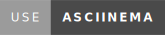
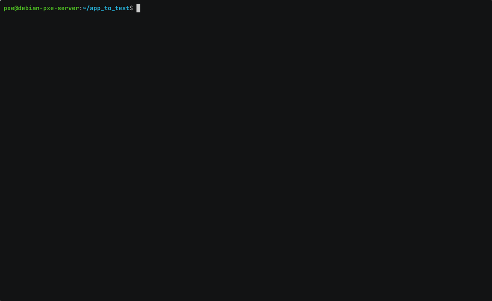
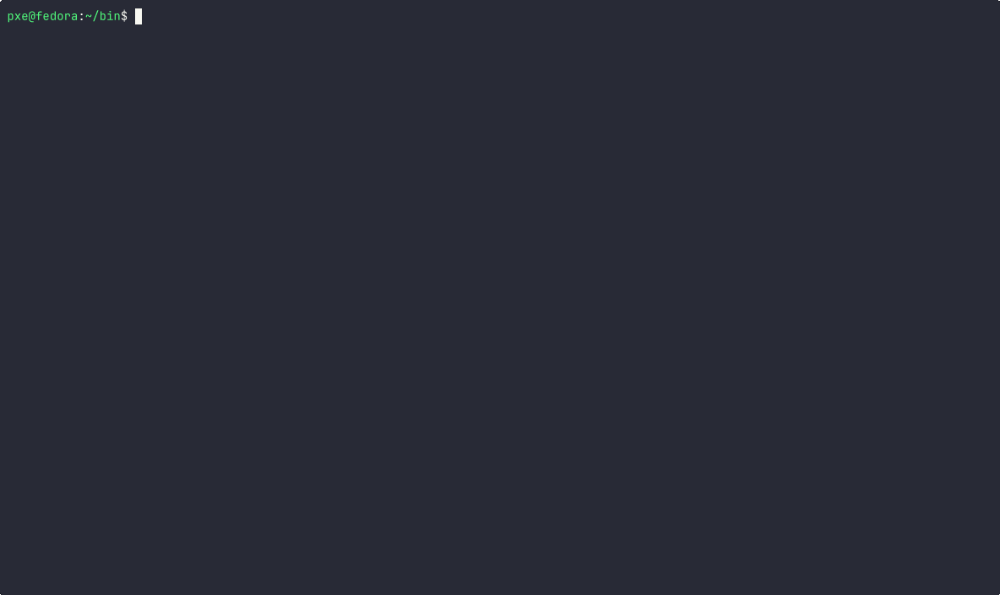

# Json_parser

# Exemple: 

## To print all json on terminal

#### You can also use standard input

### To print a specific key of json

#### You can also use standard input

### To print a specific index of key in json

#### You can also use standard input

## To print a nested oject

#### You can also use standard input

## To print a nested object with specific tab index

#### You can also use standard input

## To print all occurences of a value

#### You can also use standard input

