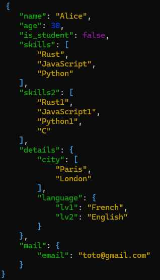
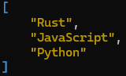
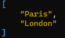

# Json_parser

[](https://forthebadge.com)

# Exemple: 

## To print all json on terminal

### Input
```./json_parser data.json or cat data.json | ./json_parser```
### Output


### To print a specific key of json

### Input
```./json_parser data.json skills or [cat (linux) | type (windows)] data.json | ./json_parser skills```
### Ouput


### To print a specific index of key in json

### Input 
```./json_parser data.json skills 2 or [cat (linux) | type (windows)] data.json | ./json_parser skills 2```
### Output
```JavaScript```

## To print a nested oject

### Input 
```./json_parser data.json details.city or [cat (linux) | type (windows)] data.json | ./json_parser details.city```
### Output
